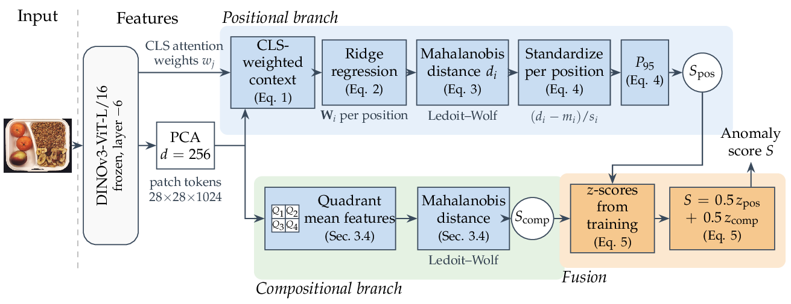
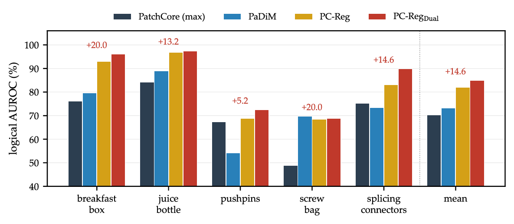

# PC-Reg: Modeling Spatial Dependencies for Logical Anomaly Detection

Code and results of the paper

> S. Villanueva López, E. Soria-Olivas, M. Sánchez-Montañés. *PC-Reg: Modeling Spatial Dependencies for
> Logical Anomaly Detection.* Submitted to *Electronics* (MDPI), 2026.

PC-Reg learns from defect-free images how each region of an image relates to its surroundings. A frozen
DINOv3 backbone provides the patch features; at every position of the feature grid, a closed-form ridge
regression predicts the patch feature from its attention-weighted neighbors, and the Mahalanobis distance of
the residual, standardized per position, measures how far the region departs from its expected context. A
second branch scores the mean features of the four image quadrants. Every parameter is fitted in closed form
(PCA, ridge regression, Ledoit-Wolf covariances); there is no gradient-based training, and the output is
deterministic.



## Results

Image AUROC (%), one fixed configuration for all categories, all methods on the same DINOv3 features and PCA
(Table 1 of the paper). LOCO: MVTec LOCO AD (combined, logical, structural); All 32: MVTec LOCO AD + MVTec AD + VisA.

| Method (ViT-L/16) | LOCO | LOCO log. | LOCO str. | MVTec AD | VisA | All 32 | BTAD |
|---|---|---|---|---|---|---|---|
| PatchCore (P95) | 75.4 | 74.4 | 77.9 | 95.5 | 86.5 | 89.0 | 95.8 |
| PatchCore (max) | 80.4 | 70.4 | 93.6 | 98.7 | 97.7 | 95.5 | 95.5 |
| PaDiM | 74.1 | 73.2 | 75.6 | 94.5 | 85.2 | 87.8 | 97.0 |
| MeanSub | 75.0 | 74.7 | 75.7 | 94.1 | 85.0 | 87.7 | 96.9 |
| PC-Reg | 81.0 | 82.1 | 80.6 | 96.6 | 87.6 | 90.8 | 97.4 |
| PC-Reg_CLS | 85.3 | 82.8 | 89.2 | 99.0 | 91.6 | 94.1 | 95.8 |
| **PC-Reg_Dual** | **85.7** | **85.0** | 87.4 | 98.8 | 92.6 | 94.4 | 96.3 |
| PC-Reg_Dual (ViT-H+/16) | 87.5 | 88.1 | 87.6 | 99.0 | 93.5 | 95.2 | |

On logical anomalies, PC-Reg_Dual is above PatchCore in all five MVTec LOCO AD categories:



## What can be checked here

| Paper | Script | Result file (as reported) |
|---|---|---|
| Table 1, Tables A1-A3 (per category), Wilcoxon tests | `scripts/run_main.py` | `results/paper/percat.csv`, `results/paper/wilcoxon.json` |
| Table 2 (components), Table A5 (fusion weight) | `scripts/run_main.py` | `results/paper/percat.csv` (variant rows) |
| Table 3 (feature-space perturbation tests) | research code | `results/paper/perturbation.csv` |
| Table 5 and Section 5.5 (inference time) | research code | `results/paper/timing/` |
| Table A4 (design study) | research code | `results/paper/ablation_*.csv` |
| Table A6, Figure A1 (few training images) | research code | `results/paper/fewshot.csv` |
| Table A8 (pixel AUROC, AUPRO) | research code | `results/paper/localization.csv` |

`python scripts/make_tables.py` prints Tables 1, 2, 3, A1-A3, A5 and A6 from these files, and
`python scripts/make_tables.py --compare` compares a fresh run of `scripts/run_main.py` (`results/reproduced/`) with them.

The method names in `percat.csv` are: `dual_final` (PC-Reg_Dual), `cls_cal` (PC-Reg_CLS), `uniform_cal`
(PC-Reg), `padim_cal`, `meansub_cal`, `patchcore_max`, `patchcore_p95`; the suffix `_raw` marks the variants
without the per-position standardization, `quad` and `gap` are the quadrant and global-mean scores alone, and
the other `dual_*` rows are the fusion variants of Tables 2 and A5.

**Reproduction check.** On the cached features of the paper, the reference implementation in `pcreg/` gives the
AUROC of `results/paper/percat.csv` for all 22 methods and variants of MVTec LOCO AD breakfast_box to within
0.03 points (the original runs stored intermediate distance maps in float16), and `scripts/extract_features.py`
reproduces the cached patch tokens (cosine similarity at least 0.9999) and CLS attention.

## Setup

Python 3.11 or later. Tested with PyTorch 2.7.1, transformers 4.57.3, scikit-learn 1.8.0 and NumPy 2.4.3.

```bash
pip install -e .            # or: uv sync
```

A CUDA GPU is needed only to extract the features (ViT-L/16: about 12 GB of memory; ViT-H+/16: 16 GB) and
speeds up the nearest-neighbor search of PatchCore. Everything else runs on a CPU.

### Datasets

Download the datasets from their original sources and place them under `data/`:

```
data/
  mvtec_loco_AD/   https://www.mvtec.com/company/research/datasets/mvtec-loco
  mvtec_AD/        https://www.mvtec.com/company/research/datasets/mvtec-ad
  VisA/            https://github.com/amazon-science/spot-diff   (with split_csv/1cls.csv, one-class split)
  btad/            https://github.com/pankajmishra000/VT-ADL     (01, 02, 03)
```

## Running

```bash
# 1. features: DINOv3 patch tokens and CLS attention of layer -6 (GPU, once per dataset)
python scripts/extract_features.py --dataset all                    # ViT-L/16, 448 x 448
python scripts/extract_features.py --dataset loco --backbone vitH   # optional ViT-H+/16, 512 x 512

# 2. detectors and baselines (CPU, resumable per category)
python scripts/run_main.py                                          # Tables 1, 2, A1-A3, A5
python scripts/run_main.py --backbone vitH --datasets loco mvtec visa

# 3. tables
python scripts/make_tables.py --source reproduced
python scripts/make_tables.py --compare
```

`scripts/run_main.py` computes PC-Reg, PC-Reg_CLS, PC-Reg_Dual and the baselines for one category in a few
minutes on a desktop CPU. Fitting PC-Reg_Dual alone takes about two minutes per category.

## Code

```
pcreg/
  config.py     fixed configuration: layer -6, d = 256, R = 5, lambda = 1, P95, alpha = 0.5
  data.py       image lists per dataset and split; loading of the cached features
  features.py   DINOv3 patch tokens and head-averaged CLS-to-patch attention
  models.py     PCReg (uniform or CLS context), QuadrantScore, PCRegDual, PaDiM / MeanSub
                (PerPositionGaussian), PatchCore (exact k = 1), AUROC
scripts/        feature extraction, run_main.py (all detectors), make_tables.py
results/paper/  the result files behind the tables of the paper
```

Minimal use of the detector on cached features:

```python
from pcreg import PCRegDual, fit_pca, project
from pcreg.data import load_category

feats, attn = load_category("loco", "breakfast_box")
pca = fit_pca(feats["train"])
model = PCRegDual(grid=28).fit(project(pca, feats["train"]), attn["train"])
scores = model.score(project(pca, feats["test_logical"]), attn["test_logical"])
```

## Configuration

One configuration for every category and dataset: DINOv3-ViT-L/16 at 448 x 448 (28 x 28 grid), patch tokens and
CLS attention of layer -6, PCA to d = 256 (fitted on the training patches), Chebyshev radius R = 5, ridge
penalty lambda = 1, Ledoit-Wolf covariances, 95th percentile over positions, equal-weight fusion (alpha = 0.5)
with z-statistics from the training scores. The optional ViT-H+/16 uses 512 x 512 inputs (32 x 32 grid).

The experiments of the paper ran on an Intel Core i9 CPU with 32 GB RAM and an NVIDIA RTX 3080 Ti laptop GPU (16 GB).
